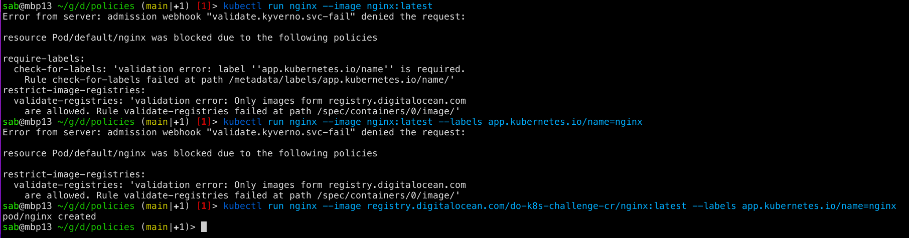

# do-k8s-challenge
 Digital Ocean Kubernetes Challenge repo, focusing on automation via GitHub
 Actions.

## Introduction

This repo contains Helm values and Github actions for the installation of the
[Kyverno](https://github.com/kyverno/kyverno).

Initial installation of the Kyverno is triggered by the manual pipeline.
Any changes to the Helm values will trigger Helm upgrade.

Policies located in the
[Policies](https://github.com/sbulav/do-k8s-challenge/policies) directory and
will be updated automatically if any policy has changed.

Main branch is write protected and all changes should be done through the
Pull Request. Each PR is linted and validated.

## Prerequisites

- [DOKS cluster](https://docs.digitalocean.com/products/kubernetes/quickstart/)
  - Digital Ocean Kubernetes Cluster Created
- [DO Personal access token](https://docs.digitalocean.com/reference/api/create-personal-access-token/)
  - Digital Ocean PAT used for getting kubeconfig
- [GitHub Personal access token](https://docs.digitalocean.com/reference/api/create-personal-access-token/)
  - GitHub Personal Access Token used for creating automatic releases

## Style

This repo follows [Conventional Commits](https://www.conventionalcommits.org).
All commits are validated for following this convention.

## Initialization

Steps required for initial deployment of Kyverno:

1. Set up Github secret with DO personal access token in variable
   `DO_K8S_TOKEN`
2. Set up Github secret with DO k8s cluster name in variable
   `DO_K8S_CLUSTER_NAME`
3. Set up Github secret with GitHub PAT in variable `RELEASE_PAT`
4. Trigger the manual pipeline [Manual deployment of Kyverno](https://github.com/sbulav/do-k8s-challenge/actions/workflows/deploy_kyverno_manual.yaml)
   for the initial installation of `kyverno` Helm Chart into your Kubernetes
   cluster. For this, set `DRY-RUN` to false. This will also install
   `kyverno-policy` and apply custom policies.

5. Check that pipeline finished successfully.

## Example: modifying Kyverno helm values

In this example, we'll modify Kyverno Helm values, adding new `reponame` label:

Create a new branch, push your changes and create a new Pull Request:

Make sure that all checks have passed. Notice that you can check `helm diff`
directly in PR.

Merge the PR and notice that deployment has been triggered automatically:

After successful deployment, you'll see new repo applied to Kyverno deployment:

If our commits had breaking changes, features or fixes, new PR with new RELEASE
will be created automatically:

## Example: Adding new Kyverno policy

In this example, we'll add new custom Kyverno policy, allowing images only from
allowed registries.

Create a new branch, push your changes and create a new Pull Request:

Make sure that all checks have passed.

Merge the PR and notice that deployment has been triggered automatically:

After successful deployment, let's try to run Pods with images from different
registries:

As you can see, image from `DockerHub` was blocked, while Policy allow to run
image from `quay.io`. Another policy require to set up correct label for app name.

After requirements were satisfied, Pod was created.
